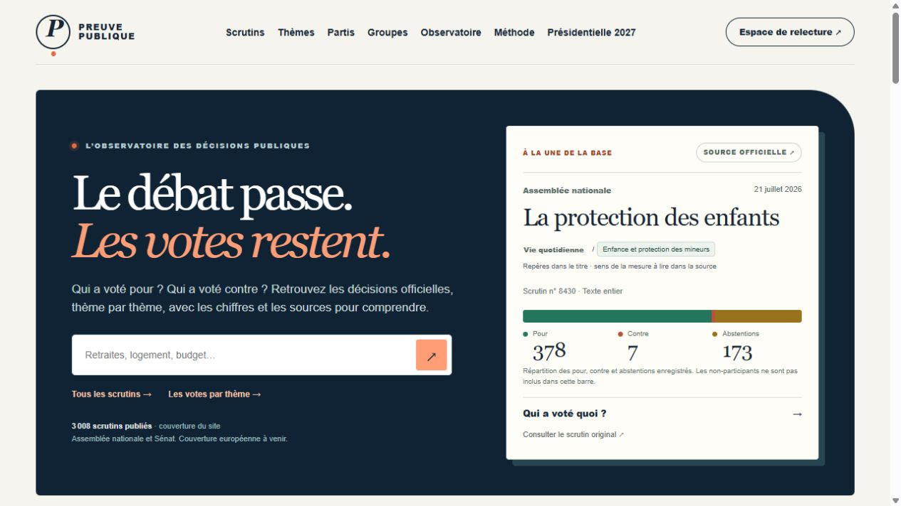
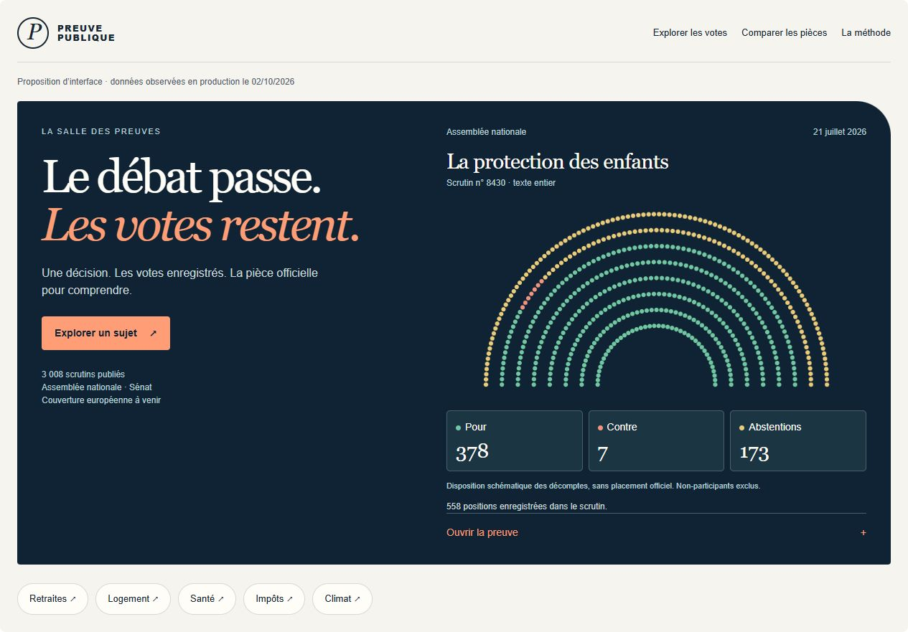

# Audit produit, parcours et direction visuelle — 2 octobre 2026

## Diagnostic

**Preuve Publique possède déjà une identité éditoriale convaincante et des garde-fous documentaires sérieux. Son principal manque est le passage de la collection de votes à un dossier qui explique une décision précise. Son principal frein visuel est une succession de cartes et de précautions qui retarde l’accès aux éléments intéressants.**

Le meilleur investissement associe trois changements : une entrée rapide par question, une visualisation mémorable d’un scrutin, puis un dossier sourcé sur la mesure exacte. Ajouter des effets décoratifs à la structure actuelle donnerait moins de valeur qu’améliorer cette progression.

L’effet « wow » proposé : **la salle des preuves**. Le visiteur voit une décision, ses votes enregistrés et la pièce d’origine. Il peut mettre une position en évidence, ouvrir la preuve et explorer le même scrutin pour plusieurs acteurs. Les absences de données font partie de la présentation.

## Périmètre et niveau de preuve

Le domaine public de production est désormais [preuve-publique.fr](https://preuve-publique.fr/). Les liens de reproduction ci-dessous utilisent ce domaine. Les observations et captures de cet audit ont été réalisées avant ce changement d'adresse, sur l'URL technique Cloud Run `https://preuve-publique-git-919818604436.europe-west1.run.app` ; cette mise à jour des liens ne constitue pas un nouvel audit du domaine ni une vérification de sa livraison.

- Lecture du `README.md`, d’`AGENTS.md`, d’`ingestion/README.md`, des guides sondages/candidats, des principaux composants publics, de leurs lectures serveur et de certaines migrations et configurations de livraison.
- Visite de l'instance de production sur l'URL technique Cloud Run lors de l'audit : accueil, scrutins, recherche et sous-thème immigration, fiche AN n° 8430, thèmes AN/Sénat, partis et profil RN, groupes, observatoire, méthode, parcours présidentiel, sondages, annuaire, fiche Marine Le Pen, comparaison de trois personnes et accès à `/admin/measures` sans session.
- Contrôles desktop à 1 280 × 720 ; mobile à 390 × 844 sur accueil, immigration, sondages et comparaison ; contrôle supplémentaire de l’accueil à 320 × 800.
- Le code audité part du commit local `eeddfd8`. Les pages de production sont observées directement. Le SHA et la révision Cloud Run actifs ne sont pas contrôlés : ne pas déduire leur identité de la présence des parcours.
- Aucun import, changement de schéma, publication, déploiement ou modification de l’application. Cet audit et ses captures sont des livrables locaux sur une branche dédiée.
- Les volumes privés et la taille actuelle de la base ne sont pas remesurés. Les chiffres du README restent des instantanés documentaires, sauf lorsqu’un affichage public les confirme ci-dessous.
- Aucun score Lighthouse, LCP, INP ou CLS n’a été mesuré. Les connexions HTTP depuis le terminal ont échoué dans cet environnement alors que la navigation navigateur fonctionnait ; ce n’est pas une preuve de panne du site. Les observations de performance sont des risques issus du code, pas des temps mesurés.

Les constats sont distingués entre **observé en production**, **constaté dans le dépôt**, **décrit dans les docs** et **proposition**. L’absence d’une fonction dans les parcours examinés ne prouve pas l’absence d’un outil privé hors dépôt.

## Ce qui fonctionne et doit être conservé

1. **Identité visuelle** : papier ivoire, bleu nuit, accent corail, titres à empattements, monogramme et formes asymétriques. Le haut de l’accueil a déjà du caractère.
2. **Une vraie matière publique** : l’accueil affiche 3 008 scrutins ; l’observatoire distingue 851 AN, 2 157 Sénat et zéro Parlement européen. Ce sont les chiffres publics observés pendant l’audit.
3. **Navigation jusqu’aux sources** : numéro, date, périmètre du scrutin, résultat et liens institutionnels sont accessibles. La fiche AN n° 8430 affiche 378 pour, 7 contre et 173 abstentions.
4. **Méthode explicite** : distinction entre groupe, parti et personne ; sujet lexical et sens d’une mesure ; bulletin manquant et abstention ; résultat observé et causalité.
5. **Comparaison existante** : trois personnes sur les mêmes lignes, avec des cellules manquantes explicites. Elle n’est pas à reconstruire depuis zéro.
6. **Sondages déjà exploitables** : configurations exactes, instituts, dates de terrain, échantillons, détail des points et provenance. Le filtre Ifop a fonctionné.
7. **Bases d’accessibilité** dans le code : lien d’évitement, focus visible, légendes, tableaux et prise en compte de `prefers-reduced-motion`. Il serait incorrect de présenter ces mécanismes comme absents.
8. **Responsive sans débordement global** dans les contrôles réalisés. Le graphique des sondages et le tableau de comparaison défilent à l’intérieur de leur conteneur.
9. **Protection publique visible de l’administration** : `/admin/measures` redirige vers la connexion sans session. Ce contrôle ne remplace pas un audit complet des droits SQL.

## Constats prioritaires sur l’expérience actuelle

### P1 — Les entrées utiles arrivent trop tard

**Observé en production.** Mesures du DOM, en pixels CSS depuis le haut de la page, susceptibles de varier avec le contenu et la fenêtre :

| Page / élément | Desktop 1 280 px | Mobile 390 px |
|---|---:|---:|
| Accueil, hauteur totale | 4 889 | 10 503 |
| Accueil, section « Partir d’une question concrète » | 3 754 | 8 481 |
| Scrutins immigration, début de la liste des résultats | 2 638 | 4 087 |
| En-tête global, hauteur | 92 | 153 |

Sur l’accueil, six scrutins puis six profils de partis précèdent les sujets. Sur mobile, les cartes passent en une colonne et multiplient la distance à parcourir. La compaction récente améliore la densité, mais la hiérarchie reste le problème principal.

**Proposition** : sujets directement dans ou après le premier écran ; trois derniers scrutins en aperçu ; un module de partis consultable sur demande ; un dossier de mesure mis en avant. Garder les détails complets sur les pages dédiées et la possibilité d’ouvrir le corpus. Pour les scrutins filtrés, résultats immédiatement après les filtres, avec synthèse accessible par onglet ou ancre clairement visible.

**Critère de livraison** : à 390 px, l’accès aux sujets ne demande plus de traverser les six fiches et les six profils. À 1 280 px, sujet, pièce et action principale sont identifiables dans le premier écran ou juste après.

### P1 — Les agrégats thématiques donnent une impression de comparaison plus forte que leur portée

**Observé en production et confirmé par la méthode.** De grands « % pour » apparaissent par thème. Dans l’exploration immigration, RN et Horizons peuvent afficher 100 % pour ; d’autres partis ont surtout des contre. Mais les volumes, scrutins et périodes diffèrent. Un vote pour peut porter sur une restriction, une ouverture ou une suppression.

Les explications existent. Le risque vient de la domination visuelle des chiffres et de la possibilité de lire les cartes comme « ce parti soutient ce sujet ». Ce n’est pas une erreur arithmétique démontrée.

**Proposition** : réserver les grands chiffres à un scrutin identifié. Pour les thèmes, privilégier une matrice de mesures/scrutins, la répartition complète et un repère immédiatement associé au corpus. Ajouter des périodes communes et un mode « mêmes scrutins disponibles », avec couverture explicite. Conserver les affiliations historiques séparées et des regroupements de navigation sourcés.

**Critère de livraison** : aucune comparaison visuelle ne laisse croire à un corpus identique si les parties comparées ont des scrutins différents. Le nombre de scrutins et la période restent visibles près du graphique ; aucun score d’orientation ne remplace les données.

### P1 — La promesse centrale reste incomplète

**Observé sur `/observatoire`** : zéro programme, zéro déclaration, zéro indicateur publié ; aucune fiche judiciaire dans le modèle présenté. La comparaison affiche des bulletins et l’absence de mesures validées. Les docs indiquent trois mesures pilotes et leurs trois liens encore en brouillon.

**Proposition** : livrer un dossier complet sur une seule question, puis deux autres. Pour chaque dossier : dispositif exact, proposition datée lorsqu’elle existe, texte/article/amendement, scrutin, statut législatif, explications sourcées et limites. Un programme absent doit rester absent. Une déclaration postérieure au vote doit être présentée comme position ultérieure.

**Critère de livraison** : un lecteur peut comprendre ce qui a été soumis au vote sans quitter le site uniquement pour découvrir le contenu de la mesure ; il peut vérifier chaque résumé dans une pièce précise. Les rapprochements interprétatifs passent par une validation humaine.

### P1 — Les votes personnels sont enfouis dans les profils

**Observé sur la fiche Marine Le Pen.** Les rattachements et les nombreuses configurations de trois sondages précèdent le choix de sous-thème et les bulletins. Une limite de trois sondages ne limite pas le nombre de configurations : la fiche reste longue, environ 5 483 px à 1 280 px.

**Proposition** : navigation locale « Votes / Propositions / Rattachements / Sondages », aperçu bref en haut, bulletins accessibles directement. Garder toutes les configurations, mais les détailler par enquête à la demande. Présenter les rattachements datés dans une frise distincte, avec leur nature.

**Critère de livraison** : depuis la fiche, le lecteur atteint les votes en une action ; chaque hypothèse de sondage reste consultable. L’identité, la couverture et l’absence de candidature officielle documentée demeurent visibles.

### P2 — Les pages Thèmes sont très longues et répétitives

**Observé** : environ 10 016 px pour l’AN et 10 597 px pour le Sénat à 1 280 px. Les 19 sous-thèmes sont présents ; certains nombres et notes de graphique sont rendus à 10 px. L’index d’ancres existe déjà.

**Proposition** : préserver la visibilité des 19 entrées et leurs aperçus ; afficher la vue détaillée du sous-thème sélectionné dans une zone stable, avec une matrice compacte ou des vues comparatives à la demande. Déplacer les répétitions de méthode vers une règle commune accessible, tout en gardant à côté des chiffres leurs limites propres.

**Critère de livraison** : découvrir les 19 sujets reste immédiat, lire un graphique n’exige pas des caractères minuscules, et les valeurs/sources ne sont pas supprimées pour gagner de la hauteur.

### P2 — Les filtres des sondages ne sont pas partageables par URL

**Observé et confirmé dans `components/polls/explorer.tsx`.** Le filtre Ifop réduit la sélection initiale de 15 sondages / 150 points à 4 sondages / 40 points, mais l’adresse reste `/presidentielle-2027/sondages`. Les filtres vivent dans l’état du composant.

**Proposition** : encoder tour, institut, période, configuration et candidats affichés dans l’URL ; ajouter « Copier cette sélection ». Le bouton retour doit restaurer la sélection. Les comparaisons de personnes ont déjà des paramètres partageables : réutiliser ce principe.

**Critère de livraison** : ouvrir un lien dans une nouvelle session reconstitue le même corpus et les mêmes options. Ne pas mélanger deux listes de candidats différentes pour dessiner une tendance.

### P2 — Les couleurs des sondages changent avec la sélection

**Constaté dans le code.** `COLORS[selected.indexOf(...)]` attribue une couleur selon la position dans la liste cochée. Décocher une personne peut donc recolorer les suivantes. Ce point est établi par lecture du code ; il n’a pas fait l’objet d’un test visuel exhaustif.

**Proposition** : mapping stable par identifiant, indépendant du filtrage. Ajouter distinction par forme ou marquage et une liste accessible des points superposés. Conserver les points individuels et les tableaux complets.

Sur mobile, le graphique a 580 px de largeur interne pour un conteneur de 327 px ; la comparaison a 690 px pour un conteneur de 343 px. Le confinement fonctionne, mais le déplacement horizontal et les petits points rendent la découverte moins immédiate.

**Critère de livraison** : une personne garde sa couleur ; sur mobile, un point peut être identifié au toucher ou via une liste sans viser un cercle minuscule.

### P2 — Recherche, filtres et synthèses ont des périmètres différents

**Observé.** La recherche « 8430 » retrouve bien une fiche lorsqu’aucun thème n’est actif. Sous immigration, elle donne zéro fiche mais la synthèse reste celle du thème entier. L’interface le précise déjà : le mot-clé n’affine que la liste.

**Proposition** : deux périmètres affichés explicitement dans les en-têtes, ou une synthèse réellement filtrée lorsque les données le permettent. Ajouter période/législature, périmètre texte/article/amendement et résultat officiel, puis des filtres amovibles et un bouton de réinitialisation. Une recherche transversale pourrait retrouver sujet, personne, groupe, parti et numéro.

**Critère de livraison** : le lecteur sait immédiatement ce que chaque filtre modifie. Ne pas annoncer la recherche par numéro comme cassée : elle a fonctionné dans le contrôle.

### P2 — La trace de validation peut suggérer une relecture humaine

**Observé sur la fiche AN n° 8430** : « relue le 30 septembre 2026 ». **Constaté dans le code** : le libellé devient « contrôlée » si `publication_method` existe, sinon « relue ». **Décrit dans le README** : une partie des publications provient d’un contrôle technique de conformité, sans relecture humaine pièce par pièce.

**Proposition** : un mode explicite « contrôle technique institutionnel / relecture humaine / rapprochement humain relu », utilisé dans toutes les publications. Afficher les contrôles réalisés plutôt qu’un badge « 99/100 » susceptible d’être pris pour une probabilité générale de vérité.

**Limite** : le mécanisme exact ayant publié cette ligne n’est pas recontrôlé dans la base privée pendant cet audit. Il faut lire sa trace avant de corriger son libellé ou les données historiques.

### P2 — Fraîcheur et couverture se résument trop souvent à un volume

**Observé** : le scrutin le plus récent de l’accueil date du 21 juillet 2026 au moment de la visite du 2 octobre. Cela ne prouve pas que l’import est bloqué ou qu’une source plus récente était disponible. Les sondages affichent une dernière synchronisation réussie au **02/10/2026 à 08:21:57**, dans le fuseau utilisé par l’interface ; cette date ne prouve pas à elle seule un passage planifié GitHub Actions avec écriture.

**Proposition** : panneau public de couverture par institution, période et type de pièce ; dernier document disponible, dernier contrôle réussi et exclusions expliquées. Ne calculer un taux de couverture que si le corpus officiel de référence fournit un dénominateur comparable.

## Fonctionnalités à construire ou approfondir

| Chantier | État et apport | Priorité | Dépendance / effort relatif |
|---|---|---|---|
| Dossiers de mesures | Passage programme/déclaration → dispositif → scrutin → devenir du texte, actuellement incomplet | P1 | Réutiliser mesures et revue ; travail éditorial important |
| Frise législative | Relier les lectures AN/Sénat, textes promulgués et application lorsqu’elle est documentée ; pas seulement des liens candidats | P1 | Références exactes, revue et données supplémentaires |
| Période commune de comparaison | Éviter de juxtaposer implicitement des corpus historiques différents | P1 | Filtres web et lectures SQL à versionner/tester séparément |
| Dossiers des élus au-delà de 2027 | Chercher une personne institutionnelle, sa circonscription ou son mandat ; l’annuaire public parcouru est celui des personnes testées dans les sondages | P2 | Sources institutionnelles et couverture nominative à étendre |
| Mesures et amendements précis | Les docs signalent que les amendements ne sont pas encore importés comme pièces dédiées ; un intitulé de scrutin ne remplace pas leur dispositif | P1/P2 | Petit lot sourcé avant extension volumineuse |
| Premier dossier européen | Le filtre existe, mais zéro scrutin européen publié | P2 | Lot vertical limité, traduction traçable, acteurs et positions documentés |
| Source inspectable à côté de la fiche | Extrait, page/article, contexte et lien original, ouverture sans perdre la lecture | P1 | Provenance existante ; extraits pertinents et droits de réutilisation |
| Export et partage | URL exacte, citation de la fiche, CSV sourcé, image de partage accessible | P2 | Licence, instantané de corpus, paramètres et limites conservés |
| Corrections publiques | Signaler une erreur de source ou d’identité, montrer date et motif des corrections | P2 | File privée de revue ; pas de publication automatique de contributions |
| Couverture et journal public | Rendre les manques, exclusions et changements compréhensibles | P2 | Synthèse publique dédiée ; garder journaux privés et secrets privés |
| Indicateurs / effets distributifs | Aucun indicateur publié ; indispensable à la promesse « vie réelle » | P2 après dossier pilote | Unité, période, territoire, méthode et limites de causalité |
| Présence et activité | Pas de taux fiable à déduire des bulletins disponibles | P3 | Dénominateur de scrutins éligibles et distinction présence/vote |
| Affaires judiciaires | Chantier décrit, modèle absent | P3 | Source judiciaire, statuts datés, recours et processus de mise à jour humaine |
| Suivi personnel / alertes | Pas de parcours observé pour conserver sujets ou fiches | P3 | Commencer par favoris locaux ; consentement avant communications |

Les absences de programmes 2027, de preuves d’adhésion et de bulletins ne sont pas des trous à remplir par supposition. Une fonctionnalité doit aider à présenter ces absences autant que les documents présents.

## Une direction visuelle pour un « wow » puissant

### Direction recommandée : la salle des preuves

**Premier écran.** Conserver le slogan et la palette. À droite, un scrutin réel devient l’objet visuel principal : points schématiques ou barres animées, date, dispositif, total et source. Une seule action domine : comprendre cette décision. Les sujets arrivent juste après.

**Interaction.** Cliquer « Pour / Contre / Abstentions » met les décomptes en évidence. « Ouvrir la preuve » révèle le résultat original et son repère. La version future permet d’inspecter des acteurs uniquement si leurs bulletins sont effectivement disponibles. Une disposition en demi-cercle doit rester explicitement schématique, sans inventer le placement officiel des élus.

**Fiche.** Trois niveaux : résumé factuel en quelques lignes ; visualisation et bulletins ; inspecteur de sources et contexte. Un menu local persistant garde ces niveaux accessibles. La légende indique le sens des positions ; la couleur n’identifie pas implicitement les partis.

**Comparaison.** Colonnes synchronisées, une ligne par même scrutin ou mesure validée, source dans un panneau adjacent. Les cellules sans bulletin gardent un état explicite. On anime le changement de sélection, sans faire apparaître un gagnant.

**Dossier.** Une frise programme/position → texte → vote → résultat, avec étapes absentes visibles. N’afficher les effets observés qu’avec un indicateur documenté, sans flèche causale implicite.

Une proposition interactive est jointe dans la conversation. Elle utilise les chiffres observés de l’AN n° 8430 : **558 positions, dont 378 pour, 7 contre et 173 abstentions**. Les 558 points ont été comptés, les sélections et l’ouverture de la preuve vérifiées ; rendu testé à 320 px et en desktop. C’est un concept, pas une modification du site déployé.

### Trois scénarios d’amélioration

| Scénario | Changement | Effet attendu | Arbitrage |
|---|---|---|---|
| **Polir l’existant** | Hiérarchie de l’accueil, sujets remontés, cartes raccourcies par aperçus, navigation mobile, texte lisible et couleurs stables | Compréhension et exploration plus rapides | Effort contenu ; signature visuelle proche de l’actuelle |
| **Salle des preuves — recommandé** | Visualisation de vote, inspecteur de source, comparaison synchronisée et une fiche pilote complète | Moment mémorable qui sert la méthode et donne envie d’explorer | Effort moyen côté interface ; dossier pilote indispensable |
| **Atlas des décisions** | Frises de dossiers, matrices de mesures, institutions et périodes, couverture détaillée | Produit de référence pour une exploration profonde | Effort élevé, données et revue avant généralisation |

### Réglages de style qui auront un effet réel

- **Hiérarchie typographique** : grands titres aux moments éditoriaux, texte courant confortable, valeurs tabulaires alignées. Éviter d’utiliser 9–10 px pour les données qui permettent de comprendre un chiffre. Une police éditoriale locale et sous licence pourrait renforcer la marque ; le gain doit être vérifié face au coût de chargement.
- **Rythme** : alterner synthèse, figure dominante et liste courte ; réduire les séries de cartes identiques. Garder l’air autour d’une idée forte, pas autour de chaque métadonnée répétée.
- **Système cohérent** : bleu nuit pour les espaces d’exploration, papier pour les sources, corail pour les actions. Les couleurs des votes gardent un sens stable et un libellé.
- **Mobilité** : menu compact avec libellé clair, action de recherche visible, sujets accessibles tôt et boutons utilisables au toucher. L’actuelle flèche de relecture en haut à droite devient une action secondaire identifiable.
- **Mouvement utile** : transitions courtes entre sélections, mise en évidence de la pièce ouverte et maintien du contexte. Respecter les préférences de réduction du mouvement et garder les chiffres lisibles sans animation.
- **États travaillés** : squelette de figure pendant un chargement, erreur avec reprise, absence de donnée contextualisée. Ne pas faire disparaître toute la scène à chaque changement de filtre.
- **Images de partage** : titre exact, date, institution, repère et décompte, avec une identité visuelle forte. Les portraits et logos sont facultatifs et demandent source, licence et traitement uniforme.
- **Apparence sombre** : ajout possible après stabilisation des contrastes et des graphiques. Le site inspecté n’expose pas de sélecteur clair/sombre ; ce n’est pas le premier levier du « wow ».

L’identité n’a pas besoin de particules, d’une scène 3D ou d’un graphisme de duel politique pour devenir reconnaissable. Les figures et interactions proposées peuvent fonctionner en SVG/CSS, sans modèle appelé à chaque visite.

## Diffusion, confiance et fonctionnement

### Métadonnées et partage — P2

**Constaté dans le dépôt et sur les titres de production** : la fiche de scrutin hérite du titre global ; les profils de personne et de parti ont un titre générique identique entre fiches. Aucun fichier `sitemap`, `robots`, image Open Graph ou métadonnées sociales dédiées n’est trouvé dans `app/`. L’accueil expose une description, sans métadonnées sociales dans l’inspection effectuée.

Créer des titres et descriptions propres aux fiches, une URL canonique, des cartes de partage et un sitemap paginé/limité aux documents publiés. Décider explicitement de l’indexation des filtres et des pages d’administration. Vérifier séparément les endpoints réellement servis : l’absence de fichier local ne suffit pas à conclure à un code HTTP précis pour `/robots.txt`.

### Transparence et retour utilisateur — P2

Le pied de page observé propose pièces, méthode et administration. Il manque un accès visible à l’équipe/projet, aux sources de financement, au contact, à la politique de correction et aux informations de confidentialité adaptées aux usages réels. Ces pages renforcent la confiance et facilitent les demandes de correction. Il ne s’agit pas ici d’une conclusion juridique sur la conformité du site.

### Performance et coût — P2

`lib/vote-theme-data.ts` calcule 22 ensembles thématiques, via deux RPC chacun, soit **44 RPC en cas de cache manquant** pour une page chargeant tous les thèmes, hors autres lectures. Le cache de cinq minutes et les lots de quatre sont déjà présents : il serait incorrect de conseiller de simplement « ajouter un cache ».

Pistes : une lecture publique groupée des agrégats, pré-calcul limité avec invalidation documentée, chargement du détail sélectionné et rendu progressif de la première section. Préserver les 19 aperçus si leur visibilité est une exigence produit. Mesurer nombre de requêtes, temps de première réponse et taille transférée avant/après. Vérifier la réutilisation du cache entre instances Cloud Run et le coût réel sur Supabase Free.

Les erreurs ne doivent pas être mises en cache comme des corpus vides. Toute nouvelle lecture/migration doit conserver RLS, limites et provenance ; les agrégats privés ne doivent pas devenir des lectures publiques accidentelles.

### Docs et exploitation — à vérifier, sans prétendre à une panne actuelle

- `ingestion/README.md` contient encore « Les positions individuelles de vote ne sont pas stockées », alors que ses premiers principes et le guide candidats décrivent `candidate_ballots`. Corriger cette contradiction en précisant le périmètre : bulletins personnels sélectionnés, agrégats par parti et couverture incomplète.
- Le README décrit deux déclencheurs de build dont un a échoué sur IAM. Relire leur état effectif, puis garder un chemin de livraison clairement contrôlé. L’audit n’a ni inspecté les builds récents ni modifié IAM.
- La page des sondages montre un succès de synchronisation ; cela ne démontre pas le succès d’une exécution quotidienne planifiée. Vérifier Actions, journal et persistance lors d’un audit d’exploitation.
- Le retour après connexion de `/admin/measures` pointe actuellement vers `/admin`, ce qui perd la destination demandée. Amélioration de confort à vérifier de bout en bout avec un compte autorisé.

## Ordre de réalisation conseillé

1. **Clarté immédiate** : remonter sujets/résultats, ajouter une navigation locale aux profils, améliorer texte et présentation des corpus. Stabiliser les couleurs des sondages et encoder leurs filtres dans l’URL. Ces changements sont largement possibles avec les données présentes.
2. **Signature visuelle** : salle des preuves sur l’accueil et une fiche, inspecteur documentaire, états de chargement cohérents et partage propre. Vérifier au clavier, au toucher, à 320/390 px et avec réduction du mouvement.
3. **Valeur différenciante** : un dossier de mesure complet relu, puis les deux autres questions pilotes. Enrichir les sources avant toute publication. Ajouter filtres de période et comparaison commune, en traitant les changements SQL séparément du web.
4. **Couverture utile** : une extension nominative et un dossier européen limités, avec contrôle de coût. Publier un tableau de couverture et un mécanisme de correction.
5. **Extension documentaire** : effets distributifs et indicateurs, puis judiciaire et présence lorsque la méthode et le dénominateur sont prêts.

Les critères de réussite sont la capacité à trouver une question, comprendre la mesure, retrouver un bulletin et vérifier la source. Les temps de parcours et erreurs de compréhension sont à mesurer avec des lecteurs ; aucun gain chiffré n’est promis sans test.

## Validation de la prochaine livraison

- Pour les changements Next.js : lire les guides de la version installée, `npm run build`, contrôles ciblés et lint selon le périmètre.
- Pour une nouvelle lecture SQL : tests réels de résultats, filtres, RLS et valeurs manquantes ; état distant et historique avant migration, vérification ciblée après application.
- Comparer mêmes fenêtres, mêmes corpus et mêmes paramètres avant/après. Vérifier absence de débordement global, défilements internes compréhensibles, focus, contrastes et états vides/erreurs.
- Le [W3C sur les contrastes](https://www.w3.org/WAI/WCAG22/Understanding/contrast-minimum.html) décrit notamment 4,5:1 pour le texte courant et 3:1 pour le grand texte. Aucun certificat de conformité n’est déduit de cet audit visuel.
- Le [W3C sur les cibles](https://www.w3.org/WAI/WCAG22/Understanding/target-size-minimum.html) prévoit un minimum de 24 × 24 px ou des exceptions de taille/espacement ; viser des commandes tactiles confortables autour de 44 px est un objectif de design, pas une affirmation que tous les petits points constituent une violation.
- Pour les performances, mesurer les [Core Web Vitals](https://web.dev/articles/vitals) et les requêtes serveur. L’audit actuel n’en fournit pas de valeurs.
- Après livraison : vérifier révision et trafic Cloud Run, puis les parcours avec les données publiques réelles. Un build réussi seul ne prouve pas une livraison.

## Captures et reproduction

- [Accueil desktop](2026-10-02-captures/accueil-desktop.png), [accueil mobile](2026-10-02-captures/accueil-mobile.png).
- [Sondages après filtrage Ifop](2026-10-02-captures/sondages-desktop.png), [tableau de comparaison](2026-10-02-captures/comparaison-desktop.png).
- [Concept de salle des preuves](2026-10-02-captures/concept-salle-des-preuves.png).
- [Fiche AN n° 8430](https://preuve-publique.fr/pieces/f8ecb9b1-9ed3-4725-b3ad-34c597314328).
- [Exploration immigration](https://preuve-publique.fr/scrutins?subject=immigration).
- [Comparaison fiscale contrôlée](https://preuve-publique.fr/presidentielle-2027/comparer?subject=fiscalite&candidate=le-pen&candidate=melenchon&candidate=attal) : cinq lignes communes observées, positions réellement présentes et cellules non disponibles. Ce tableau ne documente pas une orientation ni des propositions validées.

La proposition interactive conserve les chiffres et des liens de production dans un instantané. Elle ne lit pas la base, ne reproduit pas un placement officiel, n’attribue aucun point à une personne et n’implémente pas les futures frises de dossiers.
